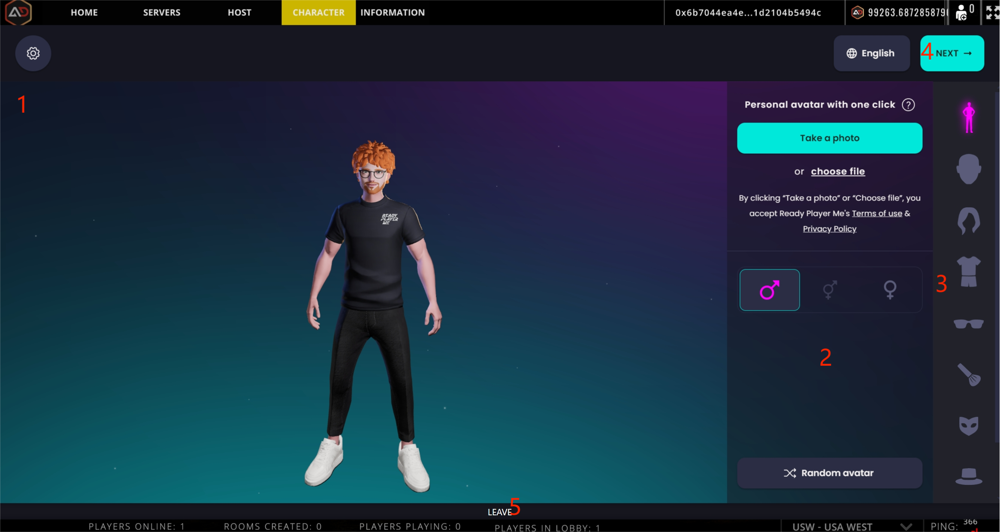
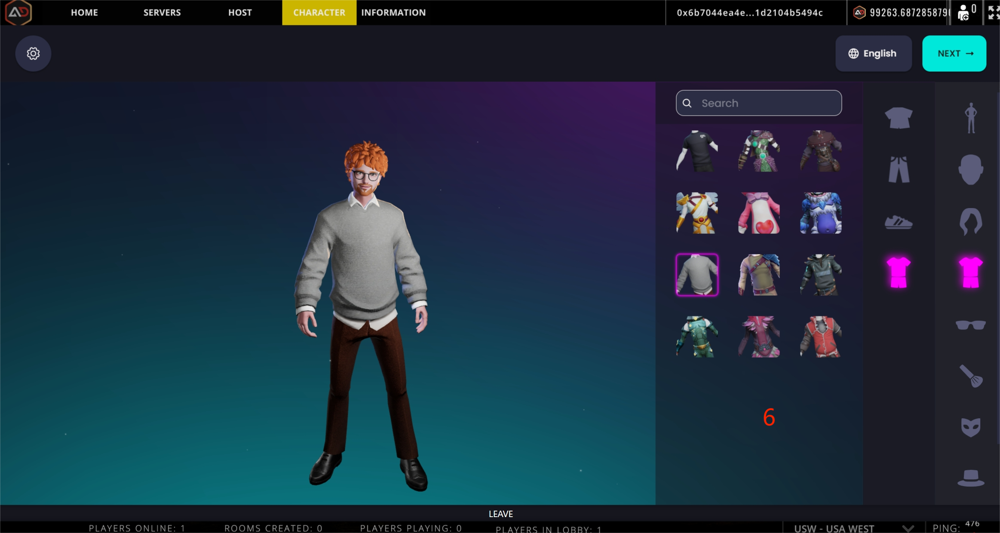
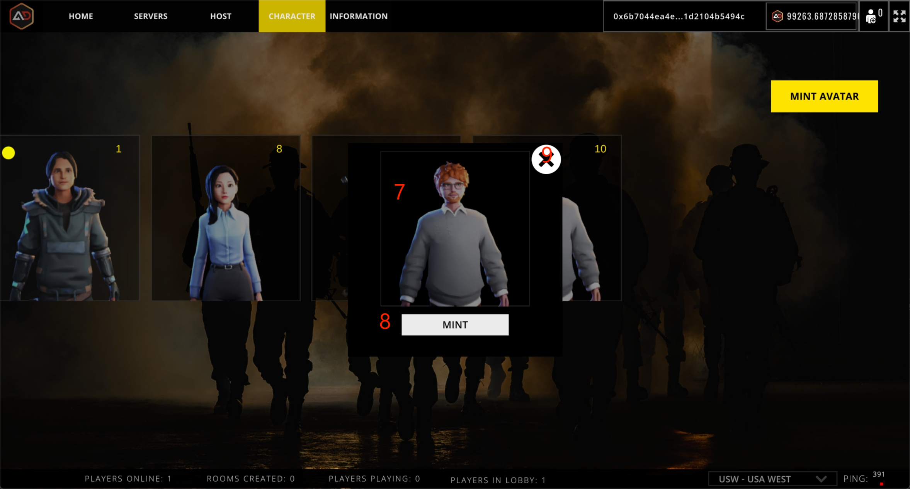

# Mint NFT

<figure><figcaption></figcaption></figure>

 

<figure><figcaption></figcaption></figure>

 

<figure><figcaption></figcaption></figure>

## 1.Character Showcase

## 2.Configure Panel

## 3.Configure Options

## 4.Next Save

Next step after selecting and matching the image.

## 5.Leave&#x20;

Exit function page.

## 6.Option details

## 7.Image thumbnail

## 8.Mint

Call the wallet plugin to access the blockchain network for mint nft.

## 9.Exit


mint nft requires that an invitation relationship exists for the current wallet, otherwise you will need to fill in the invitation code to continue to the next step.

