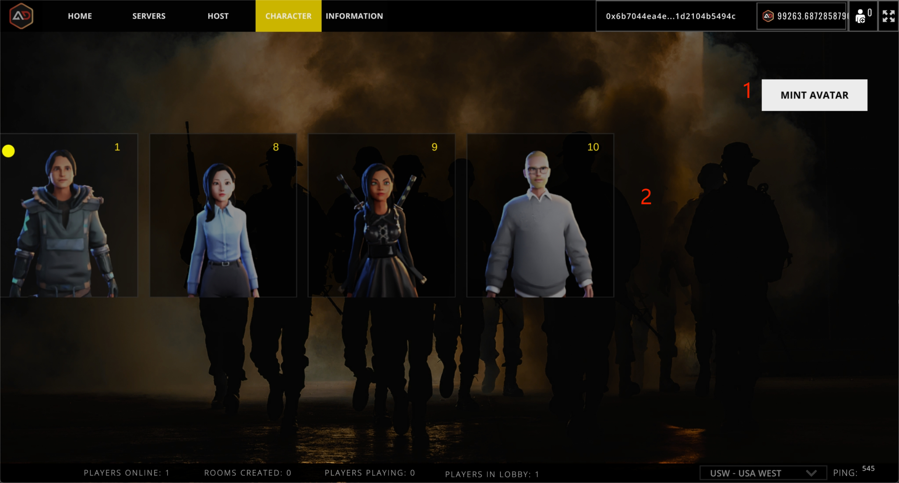

# Character & Finance

<figure><figcaption></figcaption></figure>

## 1.Mint Avatar

Combined with [RPM](https://readyplayer.me/) technology to mint the game basic nft.The basic nft is used for character modeling in the game as well as to participate in BASIC FINANCE.

## 2.Select Avatar

Displays the current basicnft owned by the wallet, and the player can choose which character to use in the game, as well as participate in basic finance.
