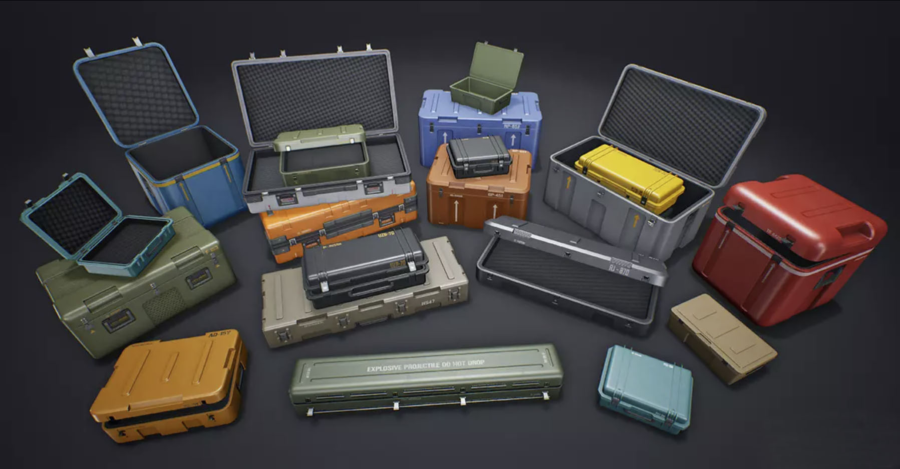
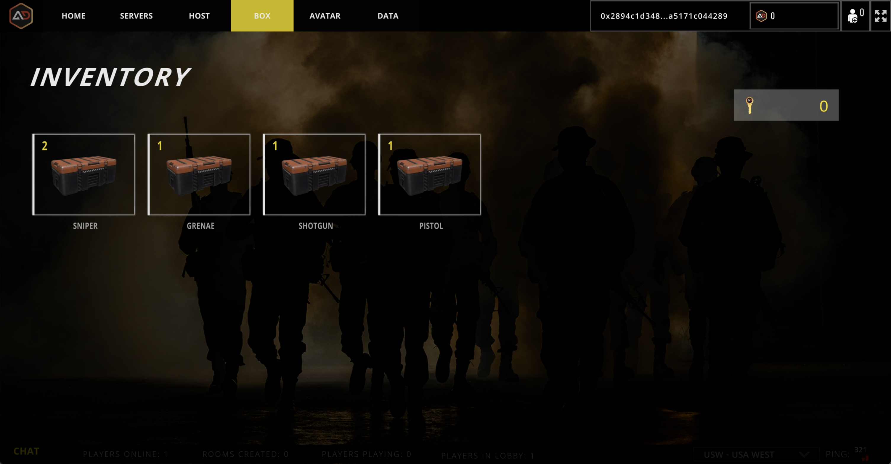
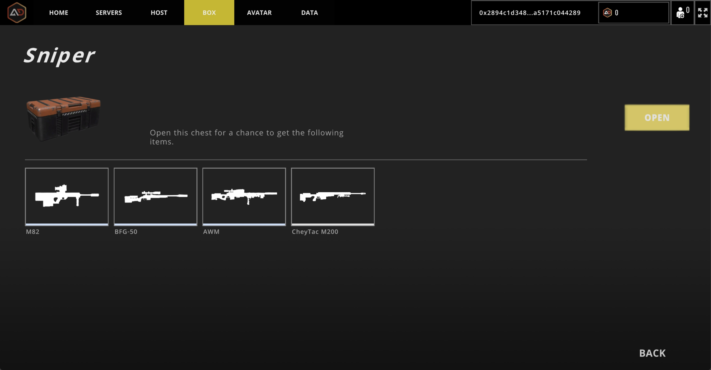
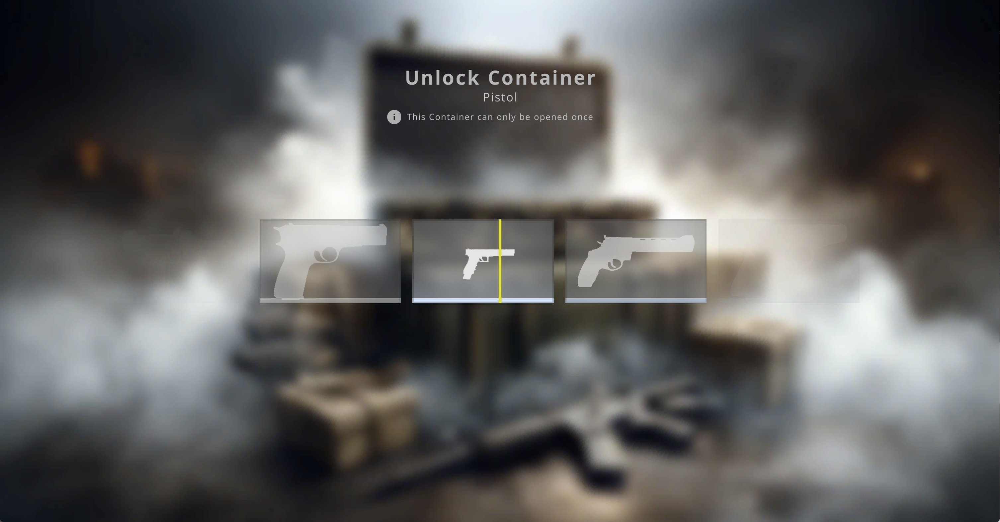

# Box & Key & Finance

<figure><figcaption></figcaption></figure>

## Box Type

<table><thead><tr><th>Name</th><th data-hidden></th></tr></thead><tbody><tr><td>Machinegun</td><td></td></tr><tr><td>Shotgun</td><td></td></tr><tr><td>Sniper</td><td></td></tr><tr><td>Pistol</td><td></td></tr><tr><td>Grenae</td><td></td></tr><tr><td>Launcher</td><td></td></tr><tr><td>Knife</td><td></td></tr><tr><td>Emblem</td><td></td></tr><tr><td>Card</td><td></td></tr><tr><td>Active box</td><td></td></tr></tbody></table>

## Key

Consumables for opening chests. Can be purchased by opening chests or in stores.

## Open Box

<figure><figcaption></figcaption></figure>

 

<figure><figcaption></figcaption></figure>

 

<figure><figcaption></figcaption></figure>

## Finance
