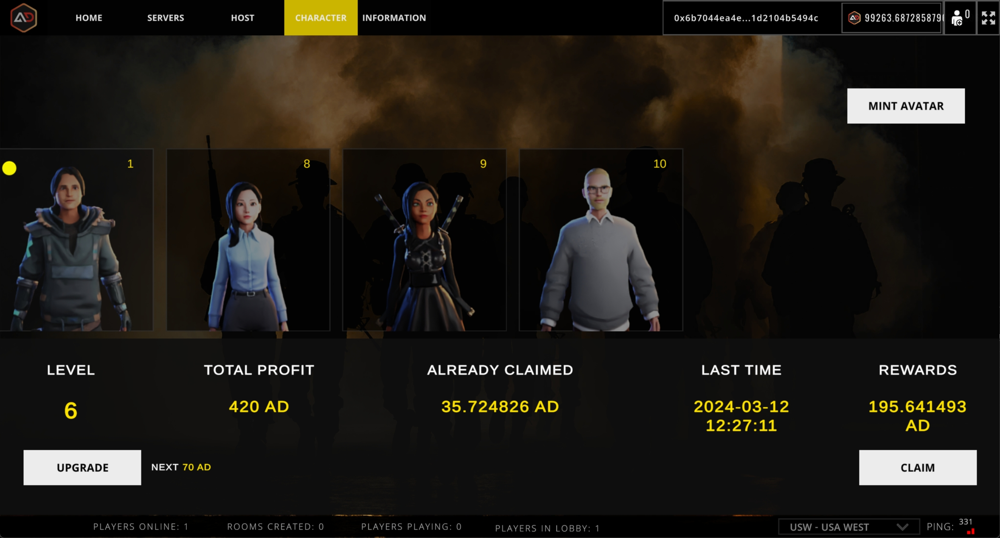

# Finance

<figure><figcaption></figcaption></figure>

## Level

The current level of the nft.

## Total Profit

The total revenue that can be produced by the current nft. The total gain is 2x the token consumed by the upgrade.

## Already Claimed

The total amount of earnings that nft has already received.

## Last Time

The time of the last operation, the mint time is displayed for nft level 0, and the claim time is displayed for levels greater than 0.

## Rewards

Number of tokens currently waiting to be claimed by nft.

## Approve

To upgrade nft, you need to token authorize the contract first.

## Upgrade

Use a token to upgrade the nft.Consumption of tokens increases in steps for each upgrade.


Consumption of the token is automatically transferred to the hosting pool.

The contract automatically spends the invitation reward to the inviter.


## Claim

Receive the profits generated by nft.


For each claim, an additional 5% will be attributed to the Development Fund.

