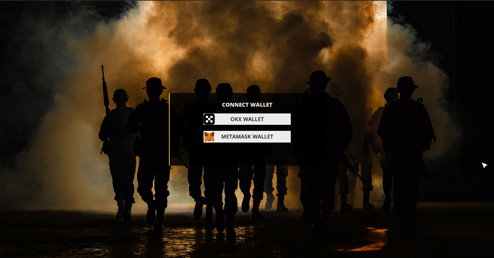

# Connect Wallet

<figure><figcaption></figcaption></figure>

Supports the mainstream OKX wallet and Metamask wallet, requires the installation of the corresponding plug-in extension in the browser.

## Links

[OKX Wallet](https://www.okx.com/web3) &#x20;

[Metamask](https://metamask.io/download/)&#x20;
