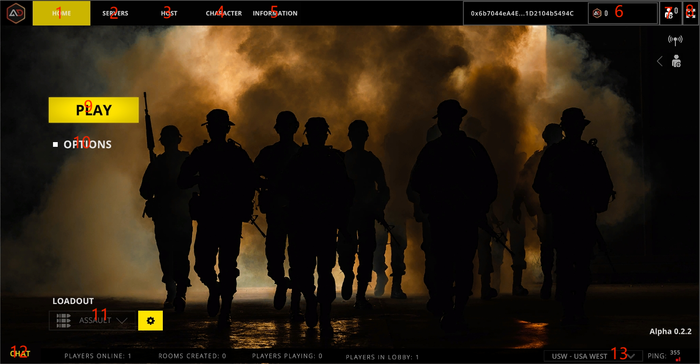

# Gaming Lobby

<figure><figcaption></figcaption></figure>

## 1.Home

The main page of the game, a unified entry point for common modules.

## 2.Servers

A list of player-created game rooms that can be optionally joined.


Displays a list of rooms for only the currently selected server partition.


## 3.Host

Players choose their own parameters to create a room to play against.

## 4.Character

Players create custom character nfts and can also participate in modules on character finance.

## 5.Information

Displays the entry point for player invitation data. Synchronized display of player earnings data earned through invitations.

## 6.Token balance

## 7.Friends data

## 8.Full screen display

## 9.Matching Rooms

Quickly join the game by selecting a game mode to match game rooms.

## 10.Game Settings

General Game Settings.

## 11.Loadout

Choose different characters with different weapon assemblies. Support assembly of weapons nft under wallet address.


Custom assembly of weapons, not open yet.


## 12.Chat

Game lobby chat room.

## 13.Select Server

Switch between different server partitions and play with players from different partitions.
