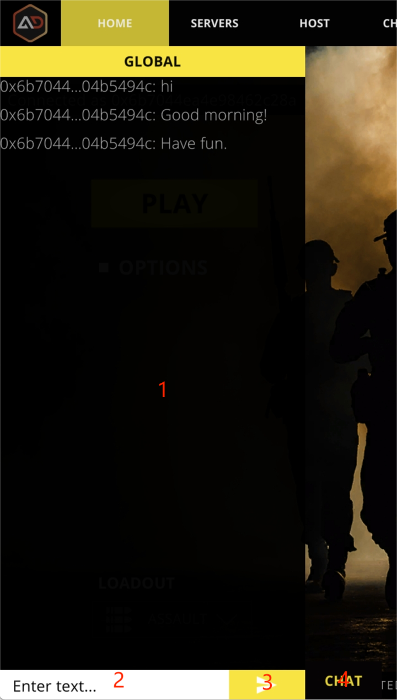

# Chat

<figure><figcaption></figcaption></figure>

## 1.Chat content


Real-time, no saved chats.


## 2.Input Text

## 3.Send

## 4.Hide Chat


Wait for the room chat. See [Waiting room](waiting-room.md)



For in-game chat, press keyboard T for chat and Y for team chat.

