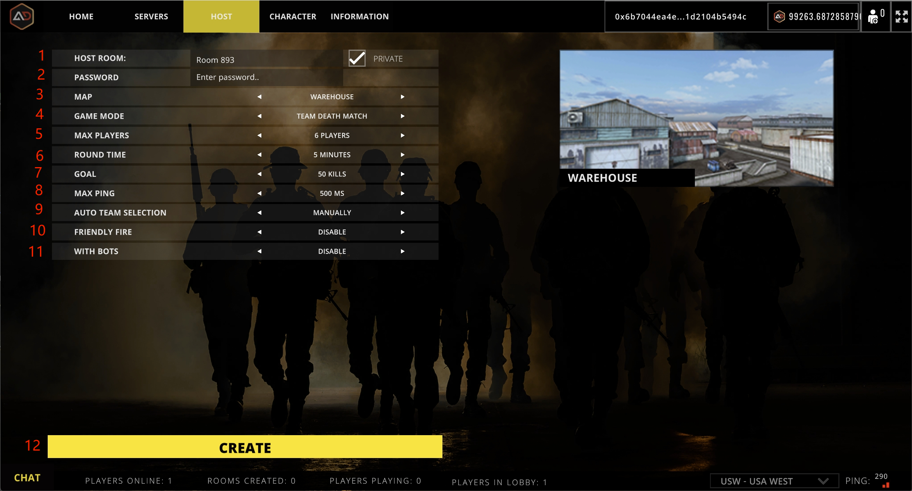

# Create Room

<figure><figcaption></figcaption></figure>

## 1.Host Room

Creates the name of the room.

## 2.Password

Set the room's private password.


The "Private" option needs to be checked to appear.


## 3.Map

Select the map for the matchup.

## 4.Game Mode

Choose the captain's game play mode.

## 5.Max Players

The maximum number of players in the room.

## 6.Round Time

Room Match Time.

## 7.Goal

The value of the target is reached. Game matchmaking reaches the goal to end the game early.

## 8.Max Ping

Players join the room with a maximum network ping, beyond which they are automatically disconnected.

## 9.Auto Team Selection

Whether to enable automatic team assignment.

## 10.Friendly Fire

Whether or not to turn on teammate damage.

## 11.With bots

Whether or not to add bots.

## 12.Create

Create room.
