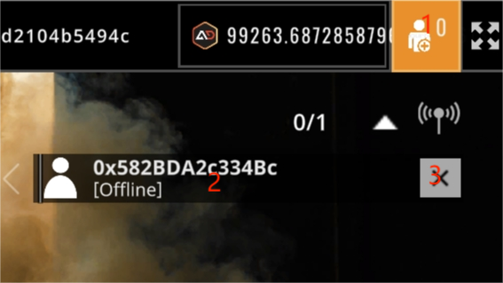
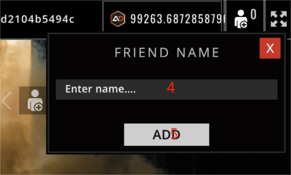

# Friend

<figure><figcaption></figcaption></figure>

 

<figure><figcaption></figcaption></figure>

## 1.Friends Statistics

Displays the current number of friends online. Also you can open Add Friends.

## 2.Friends Information

Display friend information, wallet address, online status, etc.Supports joining online friend battles.

## 3.Delete Friends

## 4.Friends Wallet Address

Fill in your friend's wallet address for adding friends.

## 5.Add Friend


Supports adding up to 25 friends.

