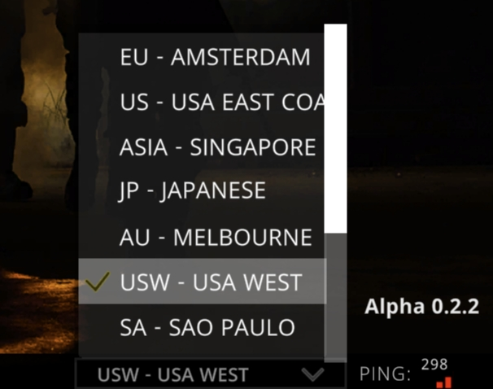

# Game Server List

<figure><figcaption></figcaption></figure>


Switching between different server partitions will only match players from the same partition.



The list of game servers will be opened flexibly according to market conditions.

