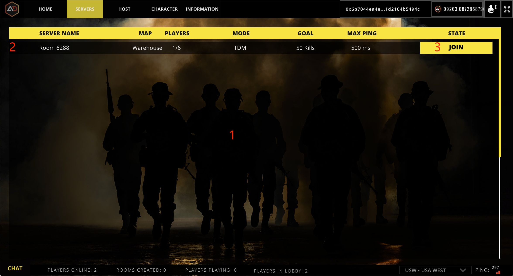

# Join Room

<figure><figcaption></figcaption></figure>

## 1.Room List

A list of current game rooms.

## 2.Room info

Setting information for the corresponding room.

## 3.Join room

Join the room
