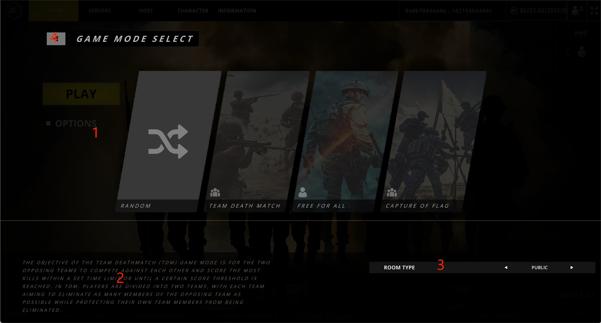

# Matching Room

<figure><figcaption></figcaption></figure>

## 1.Game Mode

Select a game mode for room matching.

## 2.Game Mode Info

Game Mode Play Description.

## 3.Room Type

Set the game type of the matching room, public or private.

## 4.Leave
