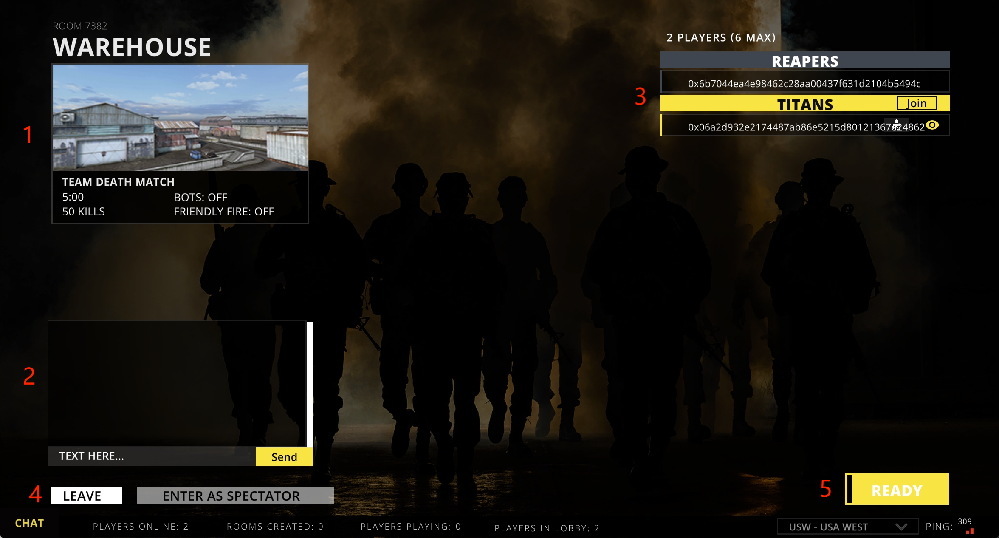

# Waiting Room

<figure><figcaption></figcaption></figure>

## 1.Room information.


Homeowners can change the settings.


## 2.Chat

## 3.Room Players


Homeowners can kick out players.


## 4.Leave Room

## 5.Ready & Start
