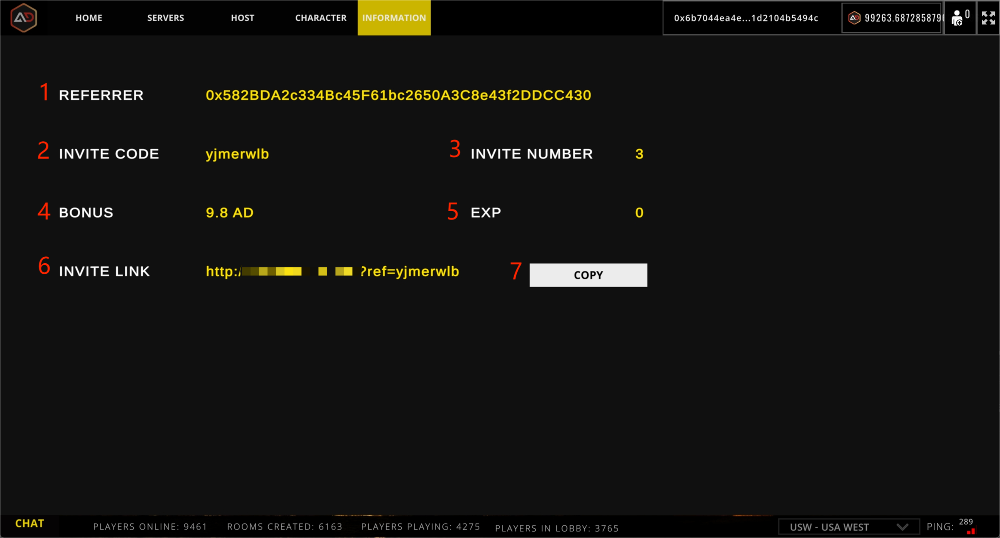

# Invitations & Rewards

<figure><figcaption></figcaption></figure>

 

<figure><figcaption></figcaption></figure>

## 1.Referrer

The address of the invitee currently bound to the wallet.

## 2.Invite Code

Invitation code for current wallet registration.

## 3.Invite Number

The number of people who have been invited to the current wallet.

## 4.Bonus

The current wallet share of the bonus.

## 5.Exp

The experience value of the current wallet address.Get data by playing the game and submitting it.

## 6.Invite Link

Invitation link to the current wallet.

## 7.Copy

Copy the invitation link to your clipboard.

## 8.Register Code

Submit an invitation code for on-chain contract registration.


You need to spend a contractually set amount of gas to be able to register.



The invitee needs mint basic nft to bind the relationship. The invitee gets a corresponding reward when using finance.



Invite up to two levels of relationship, the reward percentage is divided into 5%, 1%.

