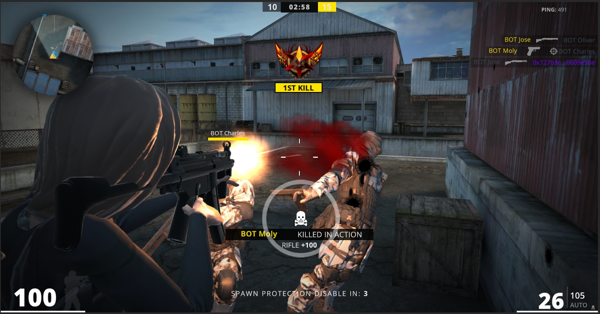
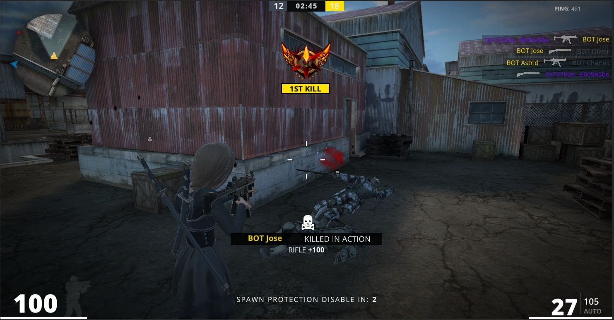
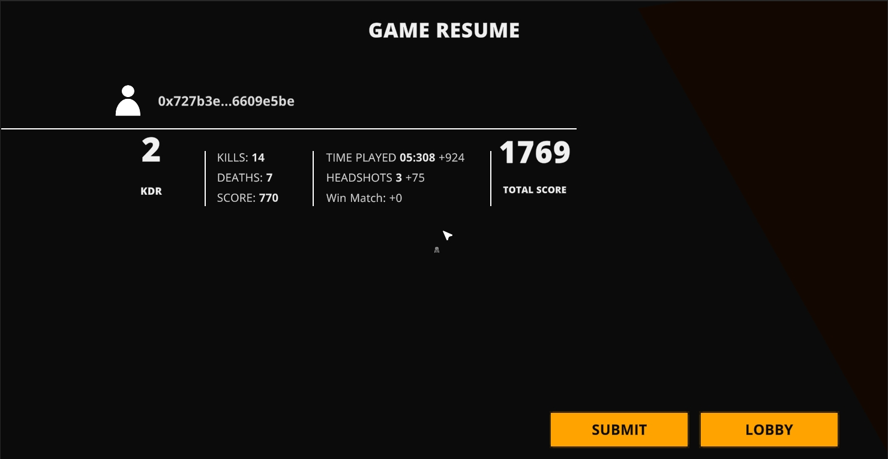

# Play & Earn

<figure><figcaption></figcaption></figure>

 

<figure><figcaption></figcaption></figure>

<figure><figcaption></figcaption></figure>

 

<figure><figcaption></figcaption></figure>


After the game battle is over submit the score to the chain contract for settlement, randomly giving different boxes.

